<h1 align="center">Teerth Sharma</h1>

<p align="center"><b>Performance and systems engineer — compilers, GPU kernels, ML infrastructure. Research in topology.</b></p>

<p align="center">
<a href="Teerth_Sharma_Resume.pdf"><b>Résumé (PDF)</b></a> &nbsp;·&nbsp; <a href="https://teerthfolio.vercel.app">Portfolio</a> &nbsp;·&nbsp; <a href="https://teerthsharma.vercel.app">Website</a> &nbsp;·&nbsp; <a href="https://www.linkedin.com/in/teerth-sharma-seal">LinkedIn</a> &nbsp;·&nbsp; <a href="https://orcid.org/0009-0005-0882-9168">ORCID</a> &nbsp;·&nbsp; <code>teerths57@gmail.com</code> &nbsp;·&nbsp; Jaipur, India
</p>

I make systems that already run at scale use less memory, run faster, and give the same answer twice. 

<p align="center"><a href="https://github.com/pulls?q=is%3Apr+author%3Ateerthsharma+is%3Amerged+sort%3Aupdated-desc"></a></p>

<p align="center"><sub><a href="https://github.com/google-deepmind/mujoco/pull/3396">mujoco #3396</a> &nbsp;·&nbsp; <a href="https://github.com/google-deepmind/mujoco_warp/pull/1541">mujoco_warp #1541</a> &nbsp;·&nbsp; <a href="https://github.com/google-deepmind/mujoco/pull/3450">mujoco #3450</a> &nbsp;·&nbsp; <a href="https://github.com/openxla/xla/pull/46539">xla #46539</a> &nbsp;·&nbsp; <a href="https://github.com/tensorflow/tensorflow/pull/124410">tensorflow #124410</a> &nbsp;·&nbsp; <a href="https://github.com/google/XNNPACK/pull/10801">XNNPACK #10801</a> &nbsp;·&nbsp; <a href="https://github.com/google/highway/pull/3244">highway #3244</a> &nbsp;·&nbsp; <a href="https://github.com/triton-lang/kernels/pull/22">kernels #22</a> &nbsp;·&nbsp; <a href="https://github.com/NVIDIA/NeMo-Relay/pull/481">NeMo-Relay #481</a> &nbsp;·&nbsp; <a href="https://github.com/NVIDIA/topograph/pull/432">topograph #432</a> &nbsp;·&nbsp; <a href="https://github.com/facebook/pyrefly/pull/4180">pyrefly #4180</a></sub></p>

<details>
<summary><b>The eleven, with links</b></summary>

| Merged | Change | PR |
| --- | --- | --- |
| **[MuJoCo](https://github.com/google-deepmind/mujoco)** · C/C++ | **1,281× less constraint-solver memory.** Dense adjacency and flood fill replaced by a disjoint-set forest; union-find primitives now public API. [Credited in the 3.11.0 release notes.](https://mujoco.readthedocs.io/en/3.11.0/changelog.html#version-3-11-0-july-27-2026) | [#3396](https://github.com/google-deepmind/mujoco/pull/3396) |
| **[MuJoCo Warp](https://github.com/google-deepmind/mujoco_warp)** · Python, Warp | **1.513× faster GPU island discovery in linear memory.** Three allocation-free, CUDA-graph-capturable phases; labels bitwise-identical under reordering. 2,048 worlds, 247,308 rows, 99% CI [1.406×, 1.584×]. | [#1541](https://github.com/google-deepmind/mujoco_warp/pull/1541) |
| **[MuJoCo](https://github.com/google-deepmind/mujoco)** · C++ | **Faster model loading.** Second quadratic scan removed from convex-hull construction, cutting probes by 3V/8; every mesh checksum byte-identical. | [#3450](https://github.com/google-deepmind/mujoco/pull/3450) |
| **[XLA](https://github.com/openxla/xla)** · C++ | **Deterministic GPU reduction grouping.** Union-find merge order followed hash order, varying the blockIdx.z constraint between builds. An insertion-ordered set makes group order a function of the graph. Landed as [3d5df1d](https://github.com/openxla/xla/commit/3d5df1da699bfb63cbeedaa56f09885c7974b06e). | [#46539](https://github.com/openxla/xla/pull/46539) |
| **[TensorFlow](https://github.com/tensorflow/tensorflow)** · C++ | **Reproducible distributed training.** The collective-ordering pass used a reachability map that was never transitively closed. Rebuilt as an exact bit-matrix closure; the emitted graph is a function of the model alone. | [#124410](https://github.com/tensorflow/tensorflow/pull/124410) |
| **[XNNPACK](https://github.com/google/XNNPACK)** · C | **32 MiB lower inference workspace.** The planner reuses the arena gap ahead of the first live tensor: 6.4% off MobileNet V1 peak allocation, outputs byte-identical. | [#10801](https://github.com/google/XNNPACK/pull/10801) |
| **[Highway](https://github.com/google/highway)** · C++ SIMD | **65× cheaper perfect-hash builds.** 894M pairwise comparisons over a million keys down to 13.6M, finding exactly the same duplicates. | [#3244](https://github.com/google/highway/pull/3244) |
| **[Triton](https://github.com/triton-lang/kernels)** · Triton | **3.48× faster long-context attention.** A sparse kernel skips 81% of blocks at 4K context and lands within 1e-3 of the dense result, shipped with a benchmark runner. | [#22](https://github.com/triton-lang/kernels/pull/22) |
| **[NeMo-Relay](https://github.com/NVIDIA/NeMo-Relay)** · Rust | **Prompt-cache reuse unblocked.** The governor keyed learning on the first user message, fragmenting shared-scaffold workflows. Re-keyed on the stable scaffold: cross-process agreement 0.48 → 1.00. | [#481](https://github.com/NVIDIA/NeMo-Relay/pull/481) |
| **[topograph](https://github.com/NVIDIA/topograph)** · Helm, K8s | **Least-privilege RBAC.** Every rule gated on the selected engine and provider, dropping the ClusterRole entirely when none applies; 141/141 chart unit tests. | [#432](https://github.com/NVIDIA/topograph/pull/432) |
| **[Pyrefly](https://github.com/facebook/pyrefly)** · Rust | **Type-checker crash pinned down.** A reproducer isolating a panic past the incremental recheck budget — 208 chained components, mechanism confirmed by the maintainer. Shipped in 1.2.0 via [3e90baa](https://github.com/facebook/pyrefly/commit/3e90baa2a44754983666b1b33cd3bcfb1b0e4a94). | [#4180](https://github.com/facebook/pyrefly/pull/4180) |

</details>

## Systems and research

<p align="center"><a href="https://github.com/teerthsharma?tab=repositories&sort=stargazers"></a></p>

<p align="center"><sub><a href="https://github.com/teerthsharma/topological-ml-toolkit">topological-ml-toolkit</a> &nbsp;·&nbsp; <a href="https://github.com/teerthsharma/Epsilon-Hollow">Epsilon-Hollow</a> &nbsp;·&nbsp; <a href="https://github.com/teerthsharma/caustic">caustic</a> &nbsp;·&nbsp; <a href="https://github.com/teerthsharma/Aether-Lang">Aether-Lang</a> &nbsp;·&nbsp; <a href="https://github.com/teerthsharma/faraday">faraday</a> &nbsp;·&nbsp; <a href="https://github.com/teerthsharma/sigmoid">sigmoid</a> &nbsp;·&nbsp; <a href="https://arxiv.org/abs/2604.19792">arXiv:2604.19792</a></sub></p>

<details>
<summary><b>The seven, with links</b></summary>

- **[Topological ML Toolkit](https://github.com/teerthsharma/topological-ml-toolkit)** · Rust, Python, C++/AVX-512, CUDA. Point clouds and time series to persistence diagrams and Betti features through scikit-learn-style transformers. Four backends, one contract, checked against ripser and GUDHI.
- **[Epsilon-Hollow](https://github.com/teerthsharma/Epsilon-Hollow)** · Rust, x86-64 assembly, QEMU/UEFI, Lean 4. Research OS testing how much of a kernel can be written in safe Rust: UEFI boot, SMP bring-up, four-level paging, demand paging, scheduling and a VFS — verified under Miri, booted in QEMU on every commit. The README says first that nothing in the kernel is production-tested.
- **[Caustic](https://github.com/teerthsharma/caustic)** · Python, PyTorch. Detects LLM hallucinations without ground-truth labels by measuring orbit collapse — when a model's internal geometry maps distinct entities onto one answer — and turns that partition into a certified lower bound on error rate. 0.995 AUROC on collapse-type failures at sub-0.5B scale; 163 tests, CI across Python 3.10–3.12, and a [results page](https://teerthsharma.github.io/caustic/) documenting where the method does not hold.
- **[Aether-Lang](https://github.com/teerthsharma/Aether-Lang)** · Rust, Lean 4. A DSL and runtime where persistent homology is a language primitive and loops terminate on topological invariants, compiling to `no_std` binaries for bare metal. 229 tests, 52 surviving mutants, six earlier claims killed by the mutation harness and documented under *What We Got Wrong*.
- **[faraday](https://github.com/teerthsharma/faraday)** · Python. 3D dielectric electromagnetic solver whose learned reduced-order coupling operator reaches a Banach fixed point at 1.755 × 10⁻¹⁶ after a 50,000-epoch burn. The run reproduces from a checkpoint in the repo.
- **[sigmoid](https://github.com/teerthsharma/sigmoid)** · Python. Converts a trained model into a world model without retraining: activation windows to persistence barcodes, a Hilbert-series embedding, a linear coupling operator with a Banach contraction certificate when ‖T‖ < 1, and a sheaf-consistency gate that fires when an imagined trajectory leaves the calibrated manifold.
- **OpenCLAW-P2P v7.0** — co-author, [arXiv:2604.19792](https://arxiv.org/abs/2604.19792), 2026. Decentralized peer-review protocol for AI research, with resilient persistence and live verification of cited references.

</details>

## Range

<p align="center"><a href="https://github.com/teerthsharma?tab=repositories"></a></p>

<sub>Bytes across source repositories, refreshed weekly by <a href=".github/workflows/languages.yml">a scheduled Action</a>. It measures what I write here, not what I land upstream — the C and C++ work above lives in other people's trees.</sub>

```text
Systems   GPU kernels, compilers, runtimes, operating systems, Linux, QEMU/UEFI, profiling, Docker, CI/CD
ML        PyTorch, JAX, TensorFlow, scikit-learn, sparse attention, inference optimisation, persistent homology
```

**Open to** performance, inference and compiler engineering roles including research engineering; residencies and mentored research placements; and collaborations that put persistent homology into a real training or inference pipeline.
