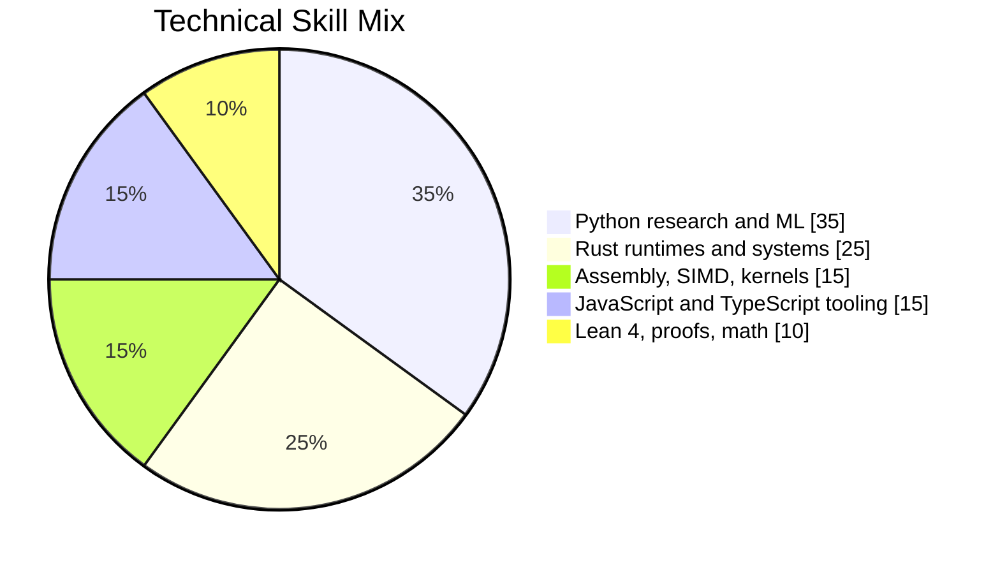

# Teerth Sharma

**Research systems engineer building where topology, physics, compilers, and low-level performance meet.**

[GitHub](https://github.com/teerthsharma) / [Website](https://teerthsharma.vercel.app) / `teerths57@gmail.com` / India

I turn hard mathematical ideas into runnable systems: topological machine learning pipelines, computational physics experiments, Rust runtimes, and hardware-aware kernels. My work usually starts with research questions and ends as code that can be inspected, benchmarked, and extended.

The pattern across my projects is simple:

- **Topology as a practical tool** for ML features, manifold embeddings, persistent homology, and physical systems.
- **Systems engineering underneath the theory** with Rust, Python, assembly, microkernels, SIMD, and runtime design.
- **Research made executable** through open repositories, reproducible experiments, benchmarks, and readable technical entry points.

## Current Focus

| Track | What I am building | Why it matters |
| --- | --- | --- |
| Topological ML | Persistent-homology features, manifold embeddings, topology-aware model tooling | Make advanced geometry usable inside real ML workflows |
| Computational physics | Electromagnetic and quantum experiments using topological operators | Explore physics models that can be simulated, measured, and verified |
| Rust runtimes | Aether-Lang, verified kernels, prefetch and I/O systems | Bring research-grade abstractions closer to production systems |
| Low-level performance | AVX-512, bare-metal kernels, SIMD math, microbenchmarking | Keep the abstractions honest by measuring what the hardware actually does |

## Tech Skill Mix



This is the way I want the profile to read: not as a random language list, but as a stack for turning advanced math into software people can run.

## Flagship Projects

### [Aether-Lang](https://github.com/teerthsharma/Aether-Lang)

A Rust runtime and language experiment for topological ML: manifold embeddings, persistent homology, and a Lean 4 verified kernel. The goal is to make topology-first computation feel like a programmable systems layer, not just a notebook experiment.

**Stack:** Rust, Lean 4, topology, runtime design

### [faraday](https://github.com/teerthsharma/faraday)

Computational Faraday Tensor work for discovering electromagnetic coupling through topology-fixed-point projection. This is the physics side of my work: mathematical structure, simulation, and measurable convergence.

**Stack:** Python, computational electromagnetics, fixed-point methods, topology

### [topological-ml-toolkit](https://github.com/teerthsharma/topological-ml-toolkit)

A Rust + Python toolkit for persistent homology, Betti-curve features, manifold embeddings, backend contracts, and benchmarked ML pipelines. This is the bridge from deep theory to something data scientists and ML engineers can actually run.

**Stack:** Python, Rust, ML tooling, persistent homology

### [aether-link](https://github.com/teerthsharma/aether-link)

High-performance I/O prefetch kernel work aimed at DirectStorage, WSL2, and latency-sensitive workloads. This is where I connect runtime ideas with the operating-system and hardware layer.

**Stack:** Rust, systems programming, I/O, performance engineering

## Technical Range

```text
Research:   topology, persistent homology, computational physics, quantum information
Systems:    Rust runtimes, microkernels, prefetching, compiler experiments
Performance: x86_64 assembly, AVX-512, SIMD kernels, benchmark-driven optimization
ML:         topological features, manifold embeddings, Python pipelines, visualization
Proofs:     Lean 4 kernels, verified abstractions, theorem-backed experiments
```

## Selected Work

| Repository | Area | Description |
| --- | --- | --- |
| [Aether-Lang](https://github.com/teerthsharma/Aether-Lang) | Rust / topology | Runtime for topological ML with manifold embeddings, persistent homology, and Lean 4 verification |
| [faraday](https://github.com/teerthsharma/faraday) | Physics / Python | Computational Faraday Tensor for topology-fixed-point electromagnetic coupling |
| [topological-ml-toolkit](https://github.com/teerthsharma/topological-ml-toolkit) | ML tooling | Persistent-homology features, Betti curves, embeddings, docs, contracts, and E2E benchmarks |
| [aether-link](https://github.com/teerthsharma/aether-link) | Systems / Rust | High-performance I/O prefetch kernel for DirectStorage, WSL2, and low-latency workloads |
| [Asmodeus](https://github.com/teerthsharma/Asmodeus) | Python research | Experimental research code and prototypes |
| [EPSILON-PHASE](https://github.com/teerthsharma/EPSILON-PHASE) | Physics / Python | Phase-oriented computational experiments |

## What I Want To Be Known For

I am building a body of work around **research-grade systems for topological computation**. The long-term direction is not just to publish clever prototypes, but to make complex topology and physics usable through APIs, runtimes, visual tools, and verified kernels.

The reviews of my GitHub profile all point to the same opportunity: the technical depth is already there. The next step is making the work easier to enter, easier to trust, and easier for other people to build on. That is the direction I am pushing now.

## Open To

- Research internships in topological ML, computational physics, quantum computing, or scientific AI
- Compiler and runtime engineering work, especially Rust, LLVM-adjacent systems, and verification
- Collaborations that turn advanced math into usable libraries, CLIs, visual tools, or papers
- Open-source funding or mentorship around Aether-Lang, topological ML tooling, and systems research

## Contact

If you are building serious systems at the edge of mathematics, physics, and machine intelligence, I want to talk.

- Email: `teerths57@gmail.com`
- Website: [teerthsharma.vercel.app](https://teerthsharma.vercel.app)
- GitHub: [@teerthsharma](https://github.com/teerthsharma)

---

**Core thesis:** abstract mathematics becomes more valuable when it compiles, runs, benchmarks, and teaches.
