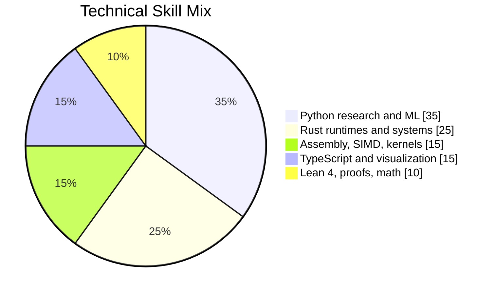

# Teerth Sharma

**Research systems engineer building where topology, physics, compilers, and low-level performance meet — actively looking for jobs, research roles, or investment.**

📄 **[Résumé (PDF)](https://drive.google.com/file/d/1fK77BW25fDQ1w52f8Mg4bw5rftzYUyP4/view?usp=sharing)**  ·  [GitHub](https://github.com/teerthsharma)  ·  [Portfolio](https://teerthfolio.vercel.app)  ·  [Website](https://teerthsharma.vercel.app)  ·  `teerths57@gmail.com`  ·  India

---

I turn hard mathematical ideas into runnable systems. The seven projects below are the flagship line: topological ML, computational physics, verified runtimes, and a microkernel OS whose day job is machine learning. Everything ships as public code with abstracts, benchmarks, honest limits, and negatives called out where they exist.

The pattern across them is simple:

- **Topology as a practical tool** — persistent homology, manifold embeddings, Betti-curve features, sheaf-consistency gates, all wired into ML and physics pipelines that a normal engineer can run.
- **Systems engineering underneath the theory** — Rust, Python, x86_64 assembly, `no_std` kernels, SIMD, bare-metal, Lean 4 verification.
- **Research made executable** — an arXiv preprint is the abstract; the repo is the proof.

---

## Flagship Projects

### 1. [Aether-Lang](https://github.com/teerthsharma/Aether-Lang) — the topological programming language

> *Programs are point clouds. Convergence is a Betti number.*

A Rust DSL and runtime where persistent homology is a language primitive, loops terminate on topological invariants, and the whole compiler produces `no_std` binaries you can drop onto bare metal. 229 tests passing, 52 injected mutants surviving, six earlier claims killed by the mutation harness and documented in the `What We Got Wrong` section. Fifteen numbered theorems from the persistence stability theorem through Chebyshev-guarded allocators, each with a matching implementation.

**Stack:** Rust · Lean 4 · persistent homology · runtime design · `no_std`

---

### 2. [topological-ml-toolkit](https://github.com/teerthsharma/topological-ml-toolkit) — the practical bridge

A Rust and Python library for turning the *shape* of data into features, diagnostics, and pipeline components. `PHFeaturizer` slots into sklearn like any other transformer. Backend contracts exist for Safe Rust, Python reference, C++, AVX-512, Triton, PyTorch, and TensorFlow without pretending gated acceleration is done. This is the entry point for ML engineers who want persistent homology in a real training pipeline, not a notebook demo.

**Stack:** Rust · Python · sklearn interop · persistent homology · Mapper · sheaves

---

### 3. [faraday](https://github.com/teerthsharma/faraday) — the physics side

> *Faraday learns a reduced-order topological operator on FDFD-derived electromagnetic fingerprints — a Banach-fixed coupling tensor that converges to machine epsilon.*

A 3D dielectric electromagnetic solver whose learned coupling operator hits a Banach fixed point at **1.755 × 10⁻¹⁶** after a 50,000-epoch burn (May 5, 2026). Betti-2 error settles at ~1.4 × 10⁻⁸. The whole run reproduces from a checkpoint in the repo. This is the seed pattern — `barcode → Hilbert embedding → least-squares operator → Banach fixed point` — that later got transplanted into sigmoid.

**Stack:** Python · computational electromagnetics · FDFD · fixed-point methods · persistent homology

---

### 4. [sigmoid](https://github.com/teerthsharma/sigmoid) — turn any model into a world model

> *Any model becomes a world model. Its weights are never touched.*

An inference engine that converts an arbitrary trained model — transformer, policy net, simulator, bare callable — into a world model *without* retraining or backpropagating through it. Encodes activation windows as persistent-homology barcodes, embeds through the Hilbert-series numerator, learns a linear coupling operator `T`. One imagined step costs **~97 µs** against an **~86 ms** forward pass — roughly **880× cheaper per step** — with a Banach contraction certificate when `‖T‖ < 1` and a sheaf-consistency gate that fires when an imagined trajectory has drifted off the calibrated manifold.

**Stack:** Python · NumPy semantics · persistent homology · Banach fixed points · sheaves

---

### 5. [caustic](https://github.com/teerthsharma/caustic) — hallucination detection from topology

A hallucination detector, repair, and governor for language models, built from the orbit partition of a relation, with **five proved bounds** behind it. Detects unreachable facts by measuring when distinct entities collapse to one answer — a topological invariant that needs no ground truth to compute. Adjusted Rand index of **1.0000** between 128 and 512 tokens of context, even as 15% of individual answers change. Equivariance AUROC **0.995**. Detector is five forward passes, no Jacobian. 163 closed-form tests.

**Stack:** Python · orbit partitions · H₀ of the answer-equivalence relation · stochastic resonance

---

### 6. [Epsilon-Hollow](https://github.com/teerthsharma/Epsilon-Hollow) — Seal OS, the geometrical operating system

> *OS state is topology on S². The kernel's day job is machine learning.*

Bare-metal x86_64. Rust-first `no_std` kernel with minimal assembly (AP trampoline, CPU-idle). No POSIX, no libc. Memory, files, and scheduler decisions are embedded as point clouds on the unit sphere. Training runs get a kernel that measures the *shape* of their overfitting. Inference gets a KV cache that evicts by elementary collapse. The README carries the honest gate table and a `Nothing In The Kernel Has Ever Been Tested` section — the OS is a research vehicle, not a production kernel, and the doc says so first.

**Stack:** Rust `no_std` · x86_64 assembly · bare metal · topology on S² · kernel-level ML

---

### 7. [Electromagnetic-Field-Data-Simulator](https://github.com/teerthsharma/Electromagnetic-Field-Data-Simulator) — the visualization front-end

A topological EM field simulator with Faraday-tensor computations behind it, a Rust/Python core, and a React GitHub Pages front-end for actually *seeing* the fields. This is the demo layer for the physics work — visual, interactive, and deployable to a static host.

**Stack:** TypeScript · React · Rust/Python core · GitHub Pages

---

## The Stack, By Weight



Not a random language list — a stack for turning advanced math into software people can run.

## Technical Range

```text
Research:    persistent homology, Mapper, sheaves, computational EM, quantum information
Systems:     Rust runtimes, microkernels, prefetching, compiler experiments
Performance: x86_64 assembly, AVX-512, SIMD kernels, benchmark-driven optimization
ML:          topological features, manifold embeddings, world-model inference, hallucination detection
Proofs:      Lean 4 kernels, verified abstractions, theorem-backed experiments
```

## What I Want To Be Known For

Research-grade systems for topological computation. The long-term direction is not clever prototypes — it is making complex topology and physics usable through APIs, runtimes, visual tools, and verified kernels. Every flagship above is one plank in that program.

I am 20 years old and I do this full-time as an independent researcher out of India, which means I am actively looking for jobs, research opportunities, and investment. I do not have a buy-me-a-coffee link because I do not like coffee hahah.

## Open To

- Research internships in topological ML, computational physics, quantum computing, or scientific AI
- Compiler and runtime engineering, especially Rust, LLVM-adjacent systems, and verification
- Collaborations that turn advanced math into usable libraries, CLIs, visual tools, or papers
- Open-source funding or mentorship around the flagship line above

## Contact

If you are building serious systems at the edge of mathematics, physics, and machine intelligence, I want to talk.

- **Email:** `teerths57@gmail.com`
- **Résumé:** [Google Drive PDF](https://drive.google.com/file/d/1fK77BW25fDQ1w52f8Mg4bw5rftzYUyP4/view?usp=sharing)
- **Portfolio:** [teerthfolio.vercel.app](https://teerthfolio.vercel.app)
- **Website:** [teerthsharma.vercel.app](https://teerthsharma.vercel.app)
- **GitHub:** [@teerthsharma](https://github.com/teerthsharma)

---

**Core thesis:** abstract mathematics becomes more valuable when it compiles, runs, benchmarks, and teaches.
